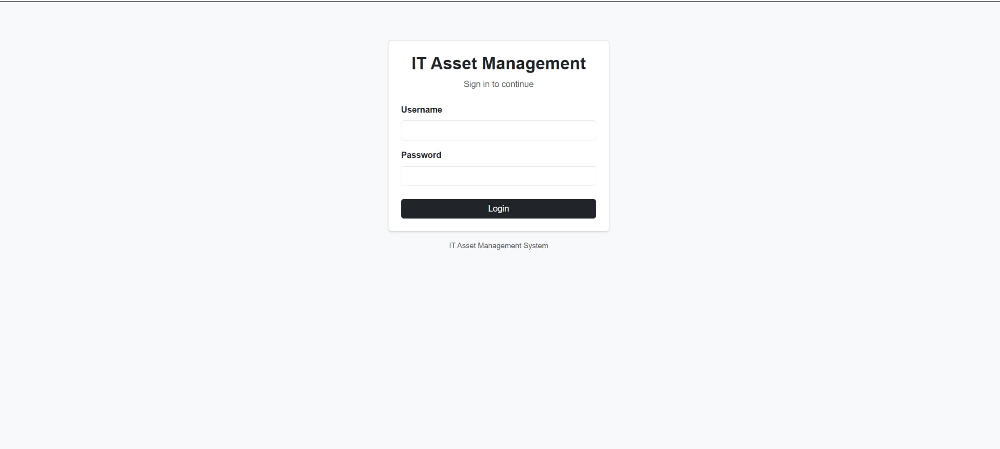
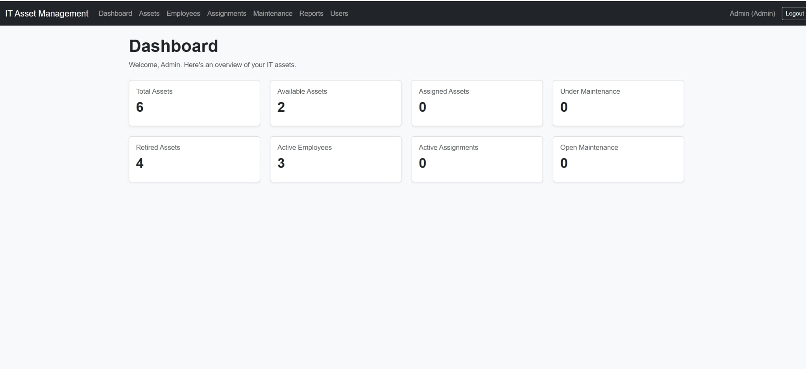
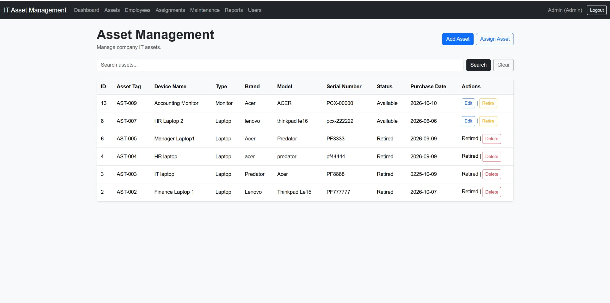
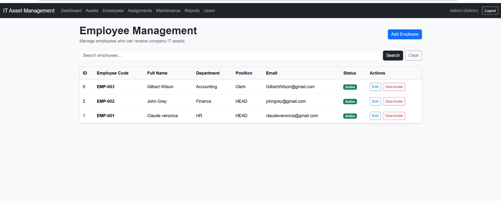
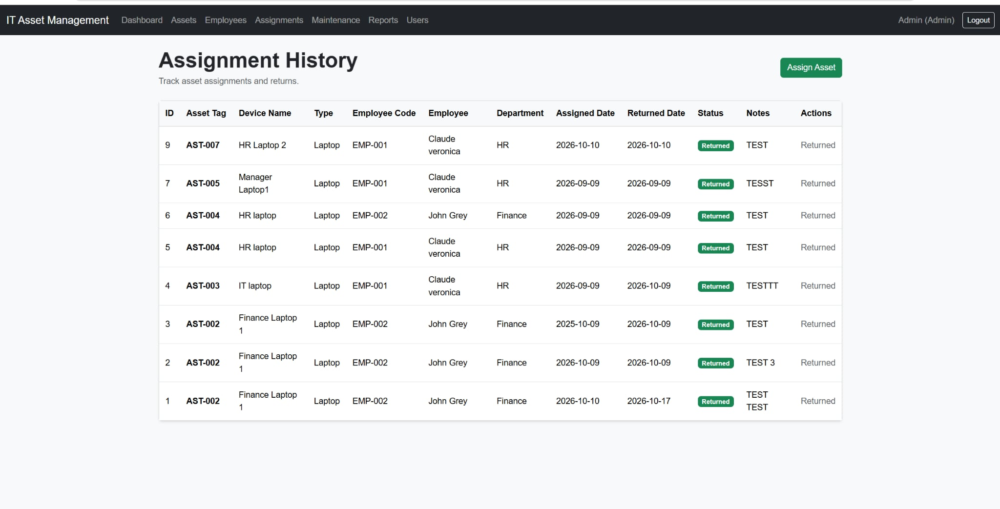
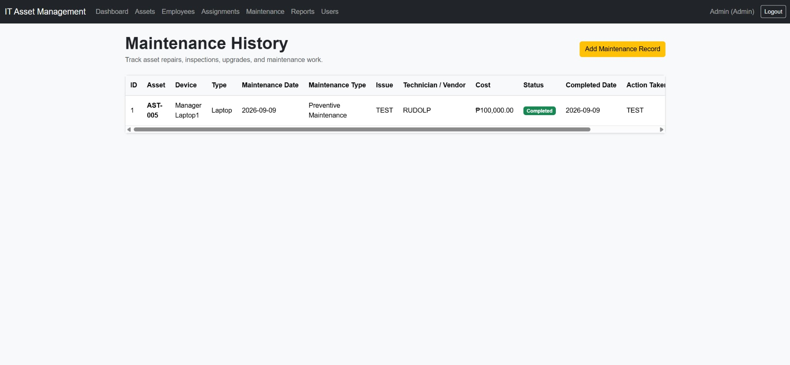
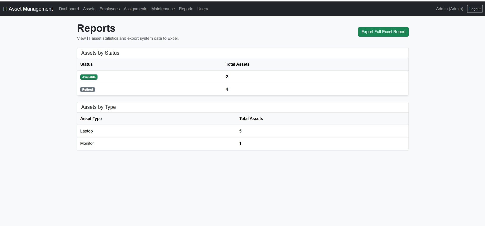
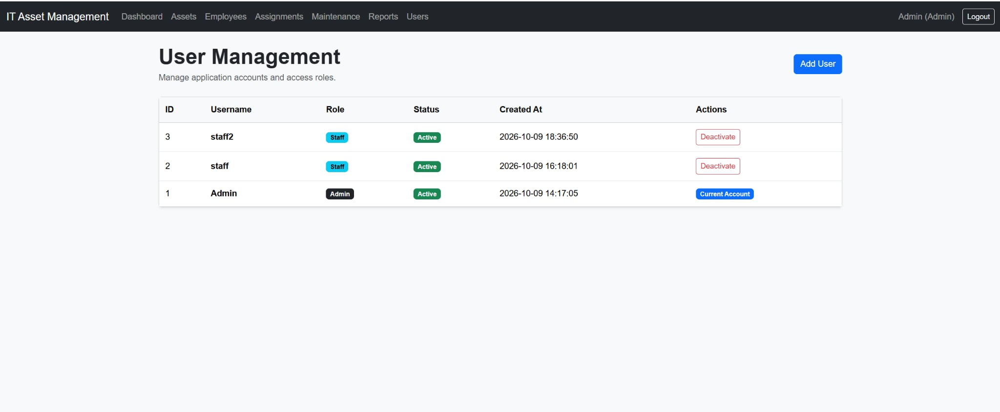

# IT Asset Management System

A Flask and MySQL application for tracking company IT assets, employees, asset assignments, maintenance records, reports, and application users. It provides a Bootstrap interface, role-based access, and a history of assignments and maintenance work.

## Key features

- **Login and logout:** Session-based authentication with hashed passwords and rejection of inactive accounts at login.
- **Admin and Staff roles:** Route-level permissions for administrative actions and everyday operations.
- **Dashboard statistics:** Counts of total, Available, Assigned, Under Maintenance, and Retired assets, plus employee totals.
- **Asset management and search:** Register assets, view inventory, search records, and edit asset information with Admin access.
- **Assignment and return:** Assign Available assets to Active employees, record dates and notes, and track returns.
- **Employee management:** Add, edit, and search employee records; Admins can deactivate employees while retaining their history.
- **Maintenance tracking:** Record repairs, inspections, upgrades, preventive maintenance, and completion details, including costs and vendors.
- **Asset retirement:** Retire eligible assets and prevent further editing in the normal workflow.
- **Safe permanent deletion:** Allow deletion only for Retired assets with no assignment or maintenance history.
- **User management:** Admins can create Admin or Staff accounts and activate or deactivate other accounts.
- **Reports:** Summaries of assets by status and type.
- **Excel export:** Download a formatted workbook with Assets, Employees, Assignments, and Maintenance worksheets.
- **Validation and transactions:** Required-field checks, duplicate checks, date and cost validation, and coordinated assignment, return, and maintenance updates.

## Asset lifecycle

```text
Available -> Assigned -> Returned / Available -> Retired
Available -> Under Maintenance -> Available
```

**Returned is an assignment status, not an asset status.** Returning an asset marks its assignment record as Returned and changes the asset back to Available. Completing maintenance marks the maintenance record as Completed and restores the asset to Available.

New assets default to Available. Assigned assets must be returned before retirement. Retired assets cannot be edited; permanent deletion is restricted to assets without assignment or maintenance history.

## Role permissions

Both roles must log in before accessing application pages. The permissions below reflect the current Flask route decorators.

| Action | Admin | Staff |
|---|---|---|
| View dashboard, assets, employees, and history | Yes | Yes |
| Search assets and employees | Yes | Yes |
| Add assets | Yes | Yes |
| Edit, retire, or permanently delete assets | Yes | No |
| Add and edit employees, including Active/Inactive status | Yes | Yes |
| Use the employee deactivation action | Yes | No |
| Assign and return assets | Yes | Yes |
| Add and complete maintenance | Yes | Yes |
| View reports and export Excel workbooks | Yes | Yes |
| View users, create accounts, and change account status | Yes | No |

An Admin cannot change their own account status. Staff requests to Admin-only routes return HTTP 403. Unauthenticated requests to protected routes redirect to login.

## Technology stack

| Technology | Purpose |
|---|---|
| Python | Application and repository logic |
| Flask | Routing, request handling, sessions, and template rendering |
| MySQL | Relational data storage |
| HTML and Jinja templates | Pages and reusable layout |
| CSS and Bootstrap 5 | Styling and responsive components |
| openpyxl | Excel workbook generation |
| Werkzeug | Password hashing and password verification |
| python-dotenv | Local environment configuration |
| mysql-connector-python | MySQL connectivity and transactions |

Dependencies are pinned in [requirements.txt](requirements.txt).

## Project structure

```text
IT-Asset-Management-System/
|-- app.py                         # Flask routes, validation, and access decorators
|-- database.py                    # Environment-based MySQL connection
|-- asset_repository.py
|-- employee_repository.py
|-- assignment_repository.py
|-- maintenance_repository.py
|-- user_repository.py
|-- dashboard_repository.py
|-- report_repository.py
|-- export_repository.py
|-- database/                      # SQL table definitions
|   |-- assets.sql
|   |-- employees.sql
|   |-- asset_assignments.sql
|   |-- maintenance_records.sql
|   `-- users.sql
|-- templates/                     # Shared layout, forms, lists, and reports
|   |-- base.html
|   |-- login.html
|   `-- ...
|-- static/css/style.css
|-- init_database.py               # Manual creation of missing tables
|-- railway.json                   # Gunicorn start command and login healthcheck
|-- setup_assets.py
|-- setup_employees.py
|-- setup_asset_assignments.py
|-- setup_maintenance.py
|-- setup_users.py
|-- create_admin.py                # Interactive first Admin account setup
|-- create_staff.py
|-- check_connection.py
|-- .env.example                   # Configuration placeholders
|-- .gitignore
|-- requirements.txt
`-- README.md
```

The local `.env` file is ignored by Git and is not included in the repository.

## Database

Local configuration defaults to the database **`it_asset_management`**. Every connection checks the selected database against `DB_EXPECTED_NAME`, which defaults to this local name. Railway deployments must explicitly set `DB_EXPECTED_NAME` to their MySQL service database name; the guard is retained rather than disabled.

| Table | Main information |
|---|---|
| `assets` | Asset tag, device name, type, brand/model, serial number, status, purchase date, and notes |
| `employees` | Employee code, name, department, position, email, and Active/Inactive status |
| `asset_assignments` | Asset and employee references, assigned/returned dates, assignment status, and notes |
| `maintenance_records` | Asset reference, maintenance type/date, issue, action taken, vendor, cost, completion date, status, and notes |
| `users` | Unique username, password hash, Admin/Staff role, and Active/Inactive status |

Foreign keys link assignments to assets and employees, and maintenance records to assets. Unique constraints protect asset tags, serial numbers, employee codes, employee emails, and usernames. New employees and users default to Active.

## Installation and local setup

### 1. Prerequisites and clone

Install Python, MySQL Server, and Git. Start MySQL before configuring the application. Use a Python environment compatible with the pinned dependencies; local workflow checks were performed with Python 3.14.

```bash
git clone https://github.com/pauljohnsuela64-prog/IT-Asset-Management-System.git
cd IT-Asset-Management-System
```

Run the following commands from the project root.

### 2. Create and activate a virtual environment

```bash
python -m venv .venv
```

Windows PowerShell:

```powershell
.\.venv\Scripts\Activate.ps1
```

macOS/Linux:

```bash
source .venv/bin/activate
```

Install dependencies after activation:

```bash
python -m pip install -r requirements.txt
```

If PowerShell blocks activation, you can run the Windows commands using `.\.venv\Scripts\python.exe` in place of `python`, without changing your execution policy.

### 3. Create local configuration

Copy `.env.example` to `.env`.

Windows PowerShell:

```powershell
Copy-Item .env.example .env
```

macOS/Linux:

```bash
cp .env.example .env
```

Configure these values in `.env`:

| Variable | Configuration |
|---|---|
| `DB_HOST` | MySQL server host, typically `127.0.0.1` for local development |
| `DB_PORT` | MySQL port, typically `3306` |
| `DB_USER` | A dedicated MySQL application account |
| `DB_PASSWORD` | That account's local password |
| `DB_NAME` | `it_asset_management` for the existing local setup |
| `DB_EXPECTED_NAME` | Expected database name; defaults to `it_asset_management` |
| `SECRET_KEY` | A long random value for signing sessions |
| `FLASK_DEBUG` | Keep `0` by default; enable debugging only during local development |

Generate and save the secret key directly to `.env` without printing it:

```bash
python -c "from secrets import token_hex; from dotenv import set_key; set_key('.env', 'SECRET_KEY', token_hex(32))"
```

The application refuses to start with a missing or example secret key. Keep this key stable between restarts; changing it invalidates existing login sessions. Never commit `.env` or share its values.

### 4. Configure MySQL

Using MySQL Workbench or the MySQL client with a database administrator account, create the database:

```sql
CREATE DATABASE IF NOT EXISTS it_asset_management;
```

Create a dedicated application account with a locally chosen password. Grant it access to `it_asset_management` and ensure the account's host matches `DB_HOST`. Table setup requires `CREATE` and foreign-key creation privileges; normal application operations require `SELECT`, `INSERT`, `UPDATE`, and `DELETE`. Enter the account details in `.env`.

Check connectivity:

```bash
python check_connection.py
```

### 5. Create the tables

For a new database, run the setup scripts in this order so referenced tables exist before foreign keys are created:

```bash
python setup_assets.py
python setup_employees.py
python setup_asset_assignments.py
python setup_maintenance.py
python setup_users.py
```

These scripts execute the SQL files under `database/`, which use `CREATE TABLE IF NOT EXISTS`. They create missing tables; they do not migrate an existing schema. Check each success message before continuing.

### 6. Create the first Admin account

```bash
python create_admin.py
```

Enter a new username, password, and matching confirmation when prompted. Password input is hidden, and the script stores a Werkzeug password hash. There are no default login credentials. After signing in, use User Management to create additional Admin or Staff accounts.

### 7. Start the application

```bash
python -m flask --app app run
```

Open [http://127.0.0.1:5000](http://127.0.0.1:5000) and sign in with the Admin account you created.

`python app.py` is also supported. Debug mode is optional for local development; never expose the development server or debugger publicly. Bootstrap is loaded from a CDN, so its styling and interactive components require access to that CDN.

## Railway deployment preparation

The repository is prepared for a Flask web service and a separate Railway MySQL service. Provisioning, deployment, and production initialization are manual steps; nothing runs against Railway automatically from local setup.

### Services and production startup

When ready to deploy, create a Railway project with a MySQL service and a web service connected to this GitHub repository. Configure variables before starting the web deployment. Use the repository root as the application root.

`railway.json` sets the production start command to:

```bash
gunicorn app:app
```

Gunicorn is pinned in `requirements.txt`. It loads the existing Flask `app` object without executing the `python app.py` development-server block. Gunicorn uses Railway's supplied `PORT` environment variable, so there is no fixed production port or URL in application code. The healthcheck uses `/login`, which does not require a database query; a successful healthcheck alone does not verify database initialization.

Local `python app.py` and Flask CLI usage remain supported. Gunicorn is intended for Linux/Unix environments, including Railway; run its startup verification on Linux rather than native Windows:

```bash
gunicorn --check-config app:app
```

Native Windows raises a missing `fcntl` error when starting Gunicorn. Local checks verified the WSGI target, installed requirements, local HTTP startup, configuration selection, and nondestructive initialization behavior with mocked database calls. Actual Gunicorn startup and Railway connectivity still need verification in the Linux deployment.

### Web-service variables

For a MySQL service named `MySQL`, add these reference variables to the **web service**. If your service has another name, adjust the references accordingly. MySQL service variables are not automatically shared with the web service.

| Web-service variable | Value or reference |
|---|---|
| `MYSQLHOST` | `${{MySQL.MYSQLHOST}}` |
| `MYSQLPORT` | `${{MySQL.MYSQLPORT}}` |
| `MYSQLUSER` | `${{MySQL.MYSQLUSER}}` |
| `MYSQLPASSWORD` | `${{MySQL.MYSQLPASSWORD}}` |
| `MYSQLDATABASE` | `${{MySQL.MYSQLDATABASE}}` |
| `DB_EXPECTED_NAME` | `${{MySQL.MYSQLDATABASE}}` |
| `SECRET_KEY` | A separately generated long random production secret, stored privately in Railway |
| `FLASK_DEBUG` | `0` |

Do not copy local `DB_*` settings or the local `.env` file into the deployment. Keep the production secret stable across restarts and separate from your development key. Do not print secrets or put them in source, screenshots, or commands saved in shell history.

**Configuration precedence:** if any local `DB_HOST`, `DB_PORT`, `DB_USER`, `DB_PASSWORD`, or `DB_NAME` variable is present, the complete local configuration is used. Otherwise the complete `MYSQL*` field configuration is used. If neither field group is present, `MYSQL_URL` is supported as an alternative. Incomplete groups fail instead of mixing credentials from different services. The port defaults to 3306 when omitted. `MYSQL_URL` must use the `mysql://` scheme without query parameters; URL-encoded usernames, passwords, and database names are decoded. A URL-only deployment still needs `DB_EXPECTED_NAME`.

The database-name guard remains active in every mode. For local use it retains the existing `it_asset_management` default. A Railway database with another name is accepted only when you explicitly configure the same expected name. A mismatch is refused before opening a connection.

### Initialize a fresh production database

After the web container is running with its variables configured, open an interactive shell **inside that web service** using the Railway CLI:

```bash
railway login
railway link
railway ssh --service YOUR_WEB_SERVICE_NAME
```

Select the intended project/environment when linking. Inside the container, change to the application root if necessary, then run:

```bash
python init_database.py
```

The initializer uses the configured database and runs the existing SQL files in dependency order: assets, employees, assignments, maintenance, then users. It only creates missing tables using `CREATE TABLE IF NOT EXISTS`; it does not drop tables, overwrite rows, seed accounts, or migrate existing tables. It stops with a nonzero exit status on errors and prints no connection credentials. MySQL table creation can commit independently, so a failed run may leave earlier tables created; resolve the cause and retry. Back up an existing production database before any manual schema operation.

Do not run initialization as a build command: Railway private database networking is available at runtime. No automatic pre-deploy or startup initialization is configured. The older individual setup scripts remain available for local use.

### Create the first production Admin

In the same interactive web-service shell, after all tables exist:

```bash
python create_admin.py
```

Choose a new username and enter a strong password twice at the hidden prompts. The existing script hashes the password and creates an Active Admin account. It does not reset or replace an existing username. Do not pass an Admin password through command arguments or commit it to an environment example.

Use the generated HTTPS web-service domain to sign in, then create further accounts through User Management. Verify database access, reports/export, and Admin/Staff permissions before sharing the application publicly. Keep the MySQL service on private networking; local commands do not resolve its private hostname, so use the remote service shell for these steps.

### Deployment limitations and remaining security work

Repository preparation is not an end-to-end Railway deployment test. A real deployment still requires provisioning MySQL, supplying the web-service variables, installing dependencies in the Linux build, initializing tables, creating an Admin, and verifying the deployed application. Configure database backups and review least-privilege access.

Before exposing sensitive data, address the existing CSRF, login rate-limiting, and session-revocation gaps described below. Configure HTTPS cookie security and deployment headers without breaking local HTTP development. These business/authentication changes are intentionally outside deployment preparation.

References: [Railway Flask guide](https://docs.railway.com/guides/flask), [Railway MySQL](https://docs.railway.com/databases/mysql), [Railway SSH](https://docs.railway.com/cli/ssh), and [Gunicorn configuration](https://docs.gunicorn.org/en/stable/settings.html).

## Security and data integrity

- **Password hashing:** Account creation uses Werkzeug hashing; login verifies the stored hash rather than comparing plaintext passwords.
- **Environment variables:** Database credentials and the session secret are configured outside application source. `.env` remains ignored by Git.
- **Authentication:** Protected pages require a session established by login. Logout clears the session, and inactive accounts cannot start a new login session.
- **Admin-only routes:** Administrative asset actions, employee deactivation, and User Management use the `admin_required` decorator.
- **Validation:** Required fields, duplicate identifiers, valid status choices, date ordering, future dates, and nonnegative maintenance costs are checked in the relevant workflows.
- **Database transactions:** Assignment, return, and maintenance workflows coordinate history records and asset status updates with commit/rollback behavior. Row locks protect relevant records during these operations.
- **History preservation:** Permanent deletion is blocked for assets with assignment or maintenance records. Employee deactivation retains employee and assignment records.

This is a portfolio application with remaining security work before public deployment. In particular, forms currently lack CSRF protection, login attempts are not rate-limited, and existing sessions are not immediately invalidated when an account is deactivated.

## Screenshots

### Login

Login form for authenticated access to the application.



### Dashboard

Overview of asset statistics and employee totals.



### Assets

Asset inventory with search, status information, and management actions.



### Employees

Employee records, departments, and Active or Inactive status.



### Assignments

Assignment history showing employee allocations and asset returns.



### Maintenance

Maintenance records with issues, costs, status, and completion details.



### Reports

Asset summaries by status and type, with access to Excel export.



### User Management

Application accounts with roles, status, and activation or deactivation actions.



## Future improvements

- Add CSRF protection to forms that modify data.
- Add login rate limiting and stronger password policy checks.
- Recheck account status during authenticated requests and invalidate sessions after deactivation.
- Add automated regression tests for routes, permissions, validation, and database transactions.
- Prepare deployment with a production WSGI server, HTTPS, secure cookie settings, and security headers.
- Review concurrent status changes and permanent deletion so safety checks remain atomic.
- Expand setup and deployment documentation as the project evolves.

## Author and learning context

Built as a hands-on software development project to practice Python, Flask, MySQL, relational database design, authentication, CRUD workflows, and application security. The project applies these skills to an IT inventory workflow with related records, role permissions, validation, and transaction handling.
